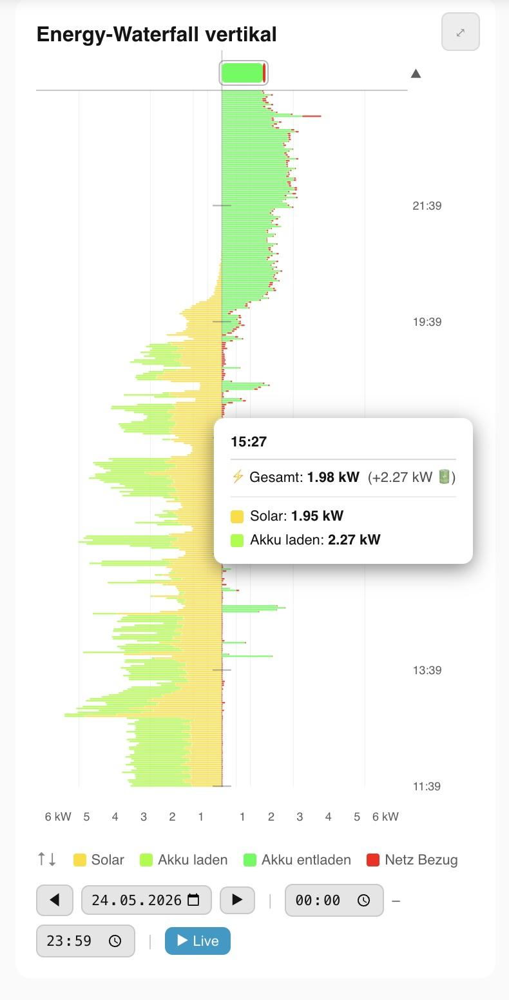
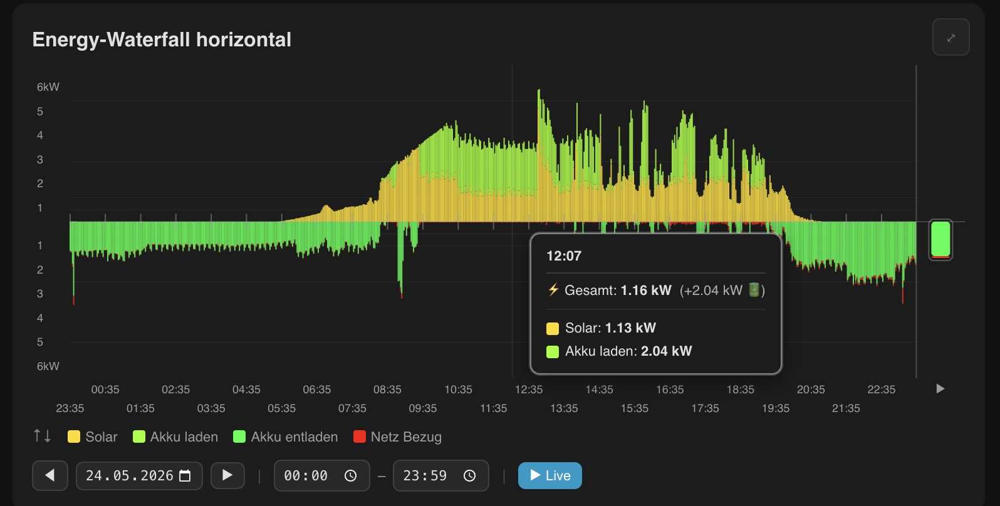
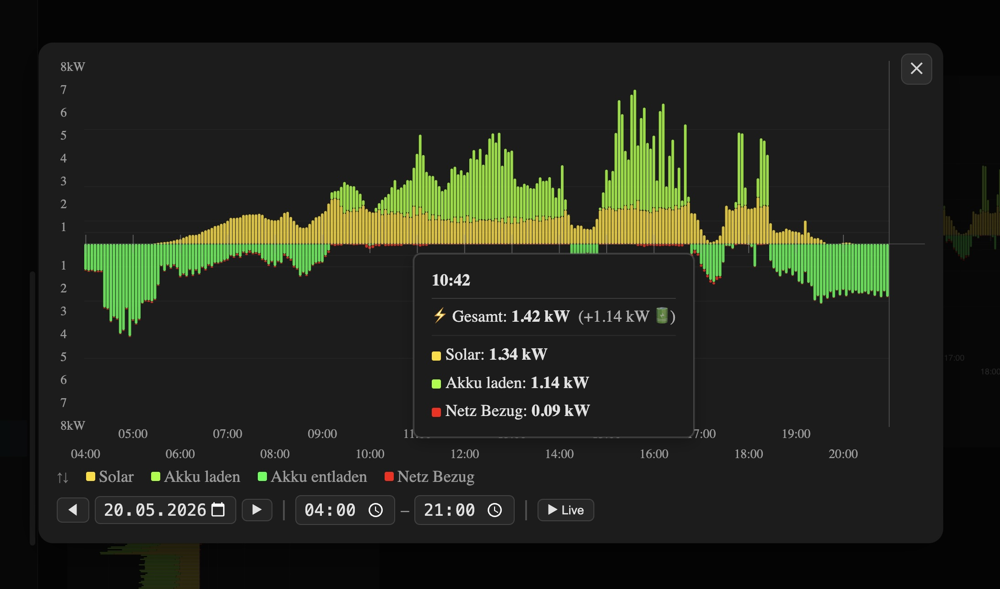

# Energy Waterfall Card

A custom Home Assistant Lovelace card that visualizes energy flow from PV, battery and grid as a waterfall diagram with live display and history.


🇩🇪 [Deutsche Dokumentation](README_de.md)

---

## Screenshots

### Vertical Layout


### Horizontal Layout (Dark Mode)


### Fullscreen Overlay


---

## Features

- **Two layout modes:** Horizontal (time → left to right) and Vertical (time ↑ bottom to top)
- **History** from the HA History API (configurable, default 10 hours)
- **Live bar** with real-time update (1-second interval) — no DOM rebuild, tooltips stay stable
- **Interactive tooltips** with configurable display duration — also on the live bar
  - Zero values automatically hidden (configurable minimum threshold)
  - Total line shows current house load including optional battery surplus
- **Min/Max display** — hover over `↑↓` in the legend shows tooltip with min/max values and timestamps, plus **markers in the chart** (tick + dashed line + label)
- **Fullscreen overlay** — click `⤢` to open enlarged view (ESC or click to close)
  - Scalable font factor (`overlay_scale`) for axes, tooltips and legend
  - Min/Max markers work in overlay too
- **kW sensor support** — configurable per sensor whether values are in W or kW
- **Auto-scaled kW axis** with configurable minimum scale and headroom
- **Adaptive time markers** — interval automatically adjusted when space is tight
- **Color picker** in visual editor with hex input
- **Separate colors** for battery charging and discharging
- **Battery inversion** for inverters with reversed sign convention (e.g. non-Deye)
- **Responsive** — ResizeObserver with debounce, adapts to card width
- **Dark/Light mode** — fullscreen overlay automatically adopts active HA theme
- **Bilingual** — German and English (automatic via HA language setting), including editor
- **No external dependencies** — pure Vanilla JS, no Lit, no imports

---

## Installation

### Manual

1. Create folder `/config/www/community/Energy-Waterfall-Card/`
2. Copy `energy-waterfall-card.js` into that folder
3. In Home Assistant go to **Settings → Dashboards → ⋮ → Resources** and add a new resource:
   - URL: `/hacsfiles/Energy-Waterfall-Card/energy-waterfall-card.js`
   - Type: `JavaScript Module`
4. Reload the page

### HACS

1. Open HACS → search for "Energy Waterfall Card"
2. Install and reload dashboard

---

## Configuration

### Minimal configuration

```yaml
type: custom:energy-waterfall-card
entities:
  pv_power: sensor.pv_power
  battery_power: sensor.battery_power
  grid_power: sensor.grid_power
  load_power: sensor.load_power
```

### Full configuration

```yaml
type: custom:energy-waterfall-card
title: Energy Waterfall
layout: vertical              # "horizontal" or "vertical"

entities:
  pv_power: sensor.pv_power           # PV power
  battery_power: sensor.battery_power # Battery (positive = discharging, negative = charging)
  grid_power: sensor.grid_power       # Grid (positive = import, negative = export)
  load_power: sensor.load_power       # House load

# Unit per sensor (true = sensor provides kW, converted to W internally)
entities_kw:
  pv_power: false
  battery_power: false
  grid_power: false
  load_power: false

# Time settings
time_window_h: 10             # History time window in hours (1–48)
slot_duration_min: 4          # Slot duration in minutes (1–30)
tick_interval_min: 60         # Time marker interval in minutes (15–360)
tick_height_pct: 80           # Time marker height/width in % (10–100)
tick_width_px: 1              # Time marker line width in px (0.5–5)

# Display
height: 200                   # Card height in px (100–800)
live_bar_size: 15             # Live block size in px (10–100)
tooltip_timeout_s: 5          # Tooltip display duration after mouse idle in seconds (1–30)
tooltip_min_w: 5              # Minimum value in Watts below which tooltip rows are hidden (0–100)
overlay_scale: 1.4            # Font scale factor in fullscreen overlay (1.0–3.0)
min_scale_w: 5000             # Minimum energy axis scale in Watts
headroom_pct: 15              # Extra space above peak value in % (0–50)

# Options
invert_battery: false         # Invert battery sign (for non-Deye inverters)

# Colors (hex format)
colors:
  solar: "#FFD400"
  battery_charge: "#00C853"
  battery_discharge: "#FF6D00"
  grid: "#FF3B30"
```

---

## Parameter Reference

| Parameter | Default | Description |
|---|---|---|
| `title` | `"Energy Waterfall"` | Card title (leave empty to hide) |
| `layout` | `"horizontal"` | `"horizontal"` or `"vertical"` |
| `entities.pv_power` | — | **Required.** Entity ID for PV power |
| `entities.battery_power` | — | **Required.** Entity ID for battery power |
| `entities.grid_power` | — | **Required.** Entity ID for grid power |
| `entities.load_power` | — | **Required.** Entity ID for house load |
| `entities_kw.pv_power` | `false` | Sensor provides kW instead of W |
| `entities_kw.battery_power` | `false` | Sensor provides kW instead of W |
| `entities_kw.grid_power` | `false` | Sensor provides kW instead of W |
| `entities_kw.load_power` | `false` | Sensor provides kW instead of W |
| `time_window_h` | `10` | History time window in hours |
| `slot_duration_min` | `4` | Slot duration in minutes (determines resolution) |
| `tick_interval_min` | `60` | Time marker interval in minutes |
| `tick_height_pct` | `80` | Time marker extension in % |
| `tick_width_px` | `1` | Time marker line width |
| `tooltip_timeout_s` | `5` | Tooltip display duration after mouse idle |
| `tooltip_min_w` | `5` | Minimum value in Watts for tooltip display |
| `live_bar_size` | `15` | Live block size in px |
| `overlay_scale` | `1.4` | Font scale factor in fullscreen overlay (1.0–3.0) |
| `height` | `200` | Card height in px |
| `min_scale_w` | `5000` | Minimum energy axis scale in Watts |
| `headroom_pct` | `15` | Extra space above peak value in % |
| `invert_battery` | `false` | Invert battery sign |
| `colors.solar` | `#FFD400` | Solar color (hex) |
| `colors.battery_charge` | `#00C853` | Battery charging color (hex) |
| `colors.battery_discharge` | `#FF6D00` | Battery discharging color (hex) |
| `colors.grid` | `#FF3B30` | Grid import color (hex) |

---

## kW Sensor Support

Some inverters provide sensor values in kilowatts instead of watts. The card always works internally in watts — enable `entities_kw` per sensor to automatically multiply values by 1000:

```yaml
entities_kw:
  pv_power: true       # sensor provides e.g. 6.5 (= 6500 W)
  battery_power: true
  grid_power: true
  load_power: true
```

In the visual editor a `kW` checkbox appears next to each entity field.

---

## Tooltip

On hover over a slot:

```
12:34
⚡ Total: 3.21 kW  (+0.64 kW 🔋)
☀ Solar: 1.57 kW
🔋 Battery charging: 0.64 kW
⚡ Grid import: 1.64 kW
```

- **Total** = Solar + Battery discharging + Grid import (= house load)
- **(+X.XX kW 🔋)** appears only when battery is currently charging (surplus)
- Values below `tooltip_min_w` Watts are hidden (default: 5W)
- Tooltip disappears after `tooltip_timeout_s` seconds of inactivity

---

## Min/Max Display

Hover over `↑↓` in the legend:

1. **Tooltip** with max and min value of total flow including timestamps
2. **Markers in the chart** at the temporal position:
   - Gold tick + dashed line + label for maximum
   - Blue tick + dashed line + label for minimum

Markers disappear when the mouse leaves the legend. Works in the fullscreen overlay too.

---

## Fullscreen Overlay

Click **⤢** to open the fullscreen overlay.

- **Close:** click **✕**, click on dark background, or press **ESC**
- **Theme:** automatically adopts active HA theme (Light/Dark)
- **Font size:** `overlay_scale` scales axes, tooltips and legend
- **Tooltips + Min/Max:** fully functional in overlay

---

## Sensor Sign Convention

| Sensor | Positive | Negative |
|---|---|---|
| `pv_power` | PV generating | — |
| `battery_power` | Battery discharging | Battery charging |
| `grid_power` | Grid import | Grid export |
| `load_power` | Consumption | — |

For reversed battery sign convention: `invert_battery: true`

---

## Layout Modes

### Horizontal
- Time: **left** (old) → **right** (new)
- Energy: **top** = Solar + Charging, **bottom** = Discharging + Grid import
- Live bar on the far **right**
- Time labels on two staggered rows
- Adaptive tick interval

### Vertical
- Time: **bottom** (old) → **top** (new)
- Energy: **left** = Solar + Charging, **right** = Discharging + Grid import
- Live strip at the **top**
- Time markers every 2 hours

---

## Technical Details

- **No ES modules:** `(function(){...})()`, no `type: module`
- **History API:** `history/history_during_period` via HA WebSocket (HA 2023.3+)
- **Gaps:** forward-fill and backward-fill interpolation
- **Performance:** live updates only change SVG attributes, no `innerHTML` reset
- **ResizeObserver:** debounced 150ms
- **Overlay:** inserted into `document.documentElement`, outside all Shadow DOMs
- **Min/Max markers:** `createElementNS` into SVG, removed on mouseleave
- **kW conversion:** `toW(val, isKw)` — multiplies by 1000 if flag is set

---

## Compatibility

| | |
|---|---|
| Home Assistant | 2023.3 and newer |
| Browser | Chrome, Firefox, Safari, Edge |
| Mobile | Fully responsive |
| Inverters | Deye, Sungrow, Huawei, Fronius and others |

---

## License

MIT License — free to use, modify and distribute.